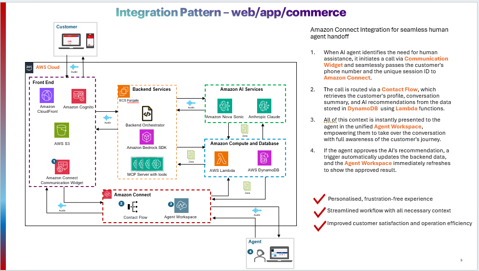
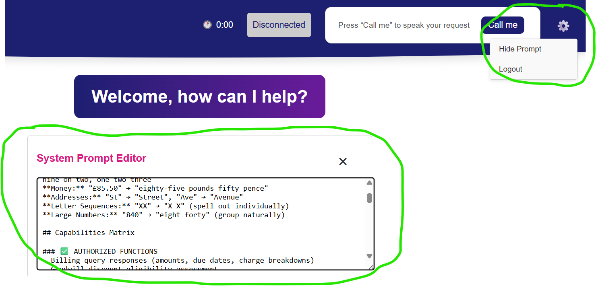

CAAG Nova Sonic for public sector & health
-----------------

Context
--------

## Table of Contents

1. [Introduction](#introduction)
2. [Architecture](#architecture)
   - [Speech-to-Speech Conversation Flow](#speech-to-speech-conversation-flow)
3. [Getting Started](#getting-started)
   - [Prerequisites](#prerequisites)
   - [Deployment](#deployment)
4. [Usage](#usage)
5. [Customization](#customization)
   - [Prompting](#prompting)
   - [Tooling](#tooling)
6. [TODO](#TODO)

## Introduction

This provides an AWS cloud-based solution for deploying applications that interact with the Amazon Nova Sonic Model. It serves as a foundation for developing future speech-to-speech tooling use cases. Unlike other implementations that required locally hosted backend and frontend, this cloud architecture leverages:

- **Frontend:** Hosted on Amazon CloudFront and S3
- **Backend:** Deployed on Amazon ECS
- **Connection:** Websocket communication through Network Load Balancer (NLB)
- **Authentication:** Integrated Amazon Cognito authentication

The sample application demonstrates Amazon Nova Sonic model interactions in a customer support context. 

## Architecture

### Speech-to-Speech Conversation Flow

1. The user signs onto the frontend hosted on Amazon Cloudfront with a static S3 web page. If the user is unauthenticated, they are re-directed to the Amazon Cognito sign on page where they can sign on with their credentials.
2. The user clicks start session to open the websocket connection to the python backend. The connect payload contains the JWT which is validated against cognito by the python backend before connection is established.
3. Speech data is transmitted bidirectionally through this connection for real-time conversation. The user speaks and audio from the user is sent to the Nova Sonic model through the python backend.
4. Nova Sonic processes the audio. It first outputs a transcription of the user audio. It then does one of two things:
   1. Outputs a response which is streamed back to the user. This response includes the assistant response audio and assistant response text.
   2. Outputs a tool use (knowledgebase query) request which is picked up and implemented by the Python backend. The backend returns the tool result to Nova Sonic which generates a final response which is streamed back to the user. This response includes the assistant response audio and assistant response text.

## Getting started

### Prerequisites

The versions below are tested and validated. Minor version differences would likely be acceptable.

- Python 3.12
- Node.js v20
- Node Package Manager (npm) v10.8
- Terraform
- Docker v27.4 (if your build environment is x86, make sure your docker environment is configured to be able to build Arm64 container images)
- AWS Account 
- Amazon Nova Sonic is available.
- Chrome, Safari, or Edge browser environment (Firefox is currently not supported)
- Working microphone and speakers

### Deployment
IMPORTANT: Ensure you are deploying to aws region `us-east-1` since this is the agreed region that currently supports Amazon Nova Sonic model in Amazon Bedrock.

- For detailed deplyment instructions use [Deployment Instructions](deployment_instructions.md)

## Usage

1. Click "Start Session" to begin
2. Speak into your microphone to interact with the application. You are acting as the customer and the solution acts as the call center agent.
3. The chat history will automatically update with the discussion transcript and the assistant audio will play through your speakers.

## Customization

### Prompting

You can change the system prompt from the UI.

### Tooling

Tooling for Amazon Nova Sonic is implemented using the Model Context Protocol (MCP) in the backend Python application. Amazon Nova Sonic outputs text indicating it wants to use a tool, the MCP server processes the tool call, and the response is returned back to the model for use in generation.

- In this example there is one tool i.e. knowledge base lookup to query against Amazon bedrock knowledge base.

## TODO
- Integration with Amazon connect if required.
- Conversation summarization and persistance.

